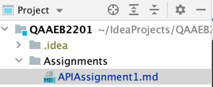

#API Assignment 1

Your answer goes here.

How to submit text assignment using git and github?

Answer. 
1. Create a directory Assignments
   
2. Create a md file APIAssignment1.md
3. Write your answers 
4. Commit and push your work in GitHub
5. Share your link to the assignment submission page

## Happy Learning!!!!